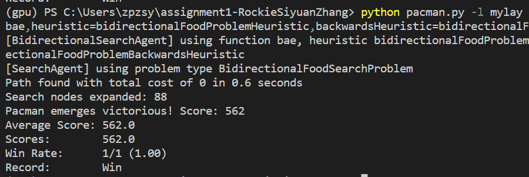

# Student Information

**Course:** COMP90054 AI Planning for Autonomy

**Semester:** Semester 1, 2023

**Student:**

Siyuan Zhang - 1380510 - SIYUAZHANG2

**Collaborated With:**

# Self Evaluation

>**Note**
> Do not exceed 500 words for each Part. This is indicative, no need to have 500 words, and it's not a strict limit.

## Part 1
#### Self Evaluated Marks (3 marks):
3

#### Code Performance

For part1, the part of the EHC algorithm, my code has completed all the test cases and passed the full score.
Explain:
The idea of this part of code is based on local search algorithm, which uses heuristic function to select the next search state. Unlike the ordinary hill climbing algorithm, it introduces a mandatory condition that the search state will only continue to move forward when its heuristic value is smaller than the current state's heuristic value. This strategy can better avoid getting stuck in local optimal solutions, and thus find better global optimal solutions.

information for mediumMaze-> bigMaze ->smallMaze ->tinyMaze

In the above examples, EHC has achieved its reasonable performance
#### Learning and Challenges
It is difficult to understand the use of getSuccessors and until.queue
#### Ideas That Almost Worked Well
For this part, I did the final code and it all passed

#### Justification

Because my code has completed all the test cases very well, and the number of expanded is also in a reasonable range, the logic of the code is also correct

#### New Tests Shared @ ED

> Tell us about your testcases and why were they useful

## Part 2
#### Self Evaluated Marks (3 marks):
3

#### Code Performance
My code passes the first two of the three official tests, and the last test returns an optimal path length, just with a slightly different path.
information for mediumMaze-> bigMaze ->smallMaze ->tinyMaze

The above are the results of the four Mazes I ran during the local test. Their paths are all optimal, and the number of expanded is completely within the expected range.
My code fully implements the pseudocode of BAE
The main idea of this algorithm is to use two heuristic functions to select the next search state, while introducing a constraint that only allows for forward progress when the heuristic value of the next state is less than the heuristic value of the current state. The algorithm uses two priority queues, one starting from the start state for forward search, and another starting from the goal state for backward search, until the two search queues meet and the minimum estimated cost exceeds the current optimal solution. During the search process, the search state with the minimum estimated cost is selected from both the forward and backward queues, and the cost estimates are updated until the two search queues meet. At the same time, a dictionary should be used to record the path length of each state to avoid re-searching states that have already been searched. The final result is the combination of the forward search path and the backward search path to find the globally optimal solution.

#### Learning and Challenges
It is difficult to understand the process of forward and reverse search and understand the conditions that they meet.

#### Ideas That Almost Worked Well
I failed the last test of part2, but the path generated by my code is also correct, and the length of the path is 138.I guess this is because the same node from different paths may have repeatedly entered backOpenList or OpenList, and the total length of these different paths is the same, and my code has not yet made a relevant distinction, that is, I should choose to enter the openlist first The current node is still entered later, which may be the reason why my return result is also optimal but the specific path is different.

#### New Tests Shared @ ED

> Tell us about your testcases and why were they useful

#### Justification
In summary, I have completed all the requirements, and the paths I tested and the number of expanded are reasonable. Although I did not return exactly the same path for the last question of the test case, my path is also reasonable. so i hope for 3 points

## Part 3
#### Self Evaluated Marks (4 marks):
2

#### Code Performance
My code has implemented all the functions that Pac-Man needs very well, can eat all the food on the map, and passed the first two of the four tests in part3, and the result of the last test is also very close to the optimal result
The logic of my code is very similar to the logic of the previous BAE code. My code will use the new distance search algorithm to find the current most suitable target and then use the BAE algorithm completed by part2 to reach the food, and then change the target and initial position until no available food left.For this reason, I rewrote the required getStartState, getGoalStates, and added self.found to indicate the number of foods that have been found, so as to ensure that my code can correctly iterate to the next food after eating a food.My new distance search algorithm also takes into account the existence of walls, making my target retrieval system more reasonable and efficient.

information for smallCorners-> capsuleA1 ->mylay

#### Learning and Challenges
Although the function is realized, the result obtained is sometimes not the optimal solution
#### Ideas That Almost Worked Well
My code did not pass the last two part3tests. It is speculated that the error is caused by repeated target retrieval, and sometimes the optimal solution cannot be returned.Seeing the discussion on ED, I realized that the getBackwardsSuccessors method needs to be seriously modified. Although it has not been implemented in the code, after thinking about it, I think that each part needs to be discussed separately. One is which coordinate current node came from, and the other is whether the current coordinate of the node has food or no food in the previous step.
The first point should not be complicated, but the second point still needs to be classified,
There are several situations: one is that there are no food on the map itself, one is that the map has food that are eaten by the previous step, and the other is that the map has food that are eaten by the previous steps (not the previous step).Only when getBackwardsSuccessors are fully written, I think there is hope to achieve the optimal solution

#### Justification
I think I have implemented all the functions needed for this part of the code, my code can eat all the food on the map, and can return the optimal path in most cases, and the number of my expanded is also quite small, which means that my algorithm Runs fast.My code also passes two of the 4 tests, and the last test is also close to being correct.So I hope for 2 marks.
#### New Tests Shared @ ED

> Tell us about your testcases and why were they useful
